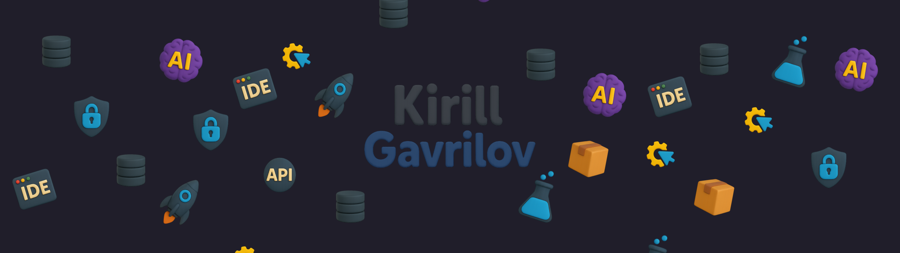

## Hey there 👋

I'm a TechLead Backend at GetBlock.io.

### 📝 About Me

- 🔭 I'm currently working on backend and DevOps in blockchain companies.
- 🌱 I'm dedicated to the growth of the kyb_chait community.

### 📌 My GitHub Repositories

In my GitHub account, you'll find various repositories showcasing my work in Golang, Node.js, and Shell. These projects cover different areas related to blockchain, DevOps, and backend development.

Feel free to check out my repositories and give them a ⭐ if you find them interesting!

## 💼 Skills

## Statistic

